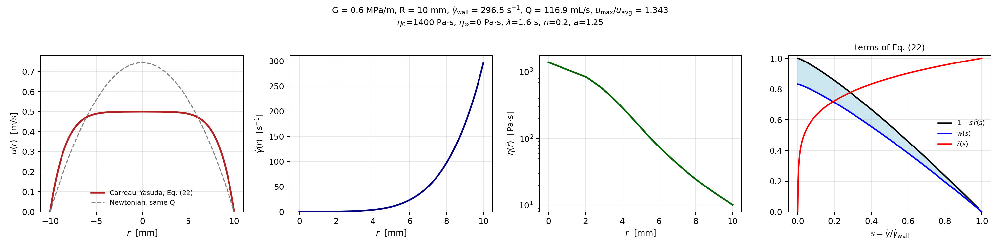
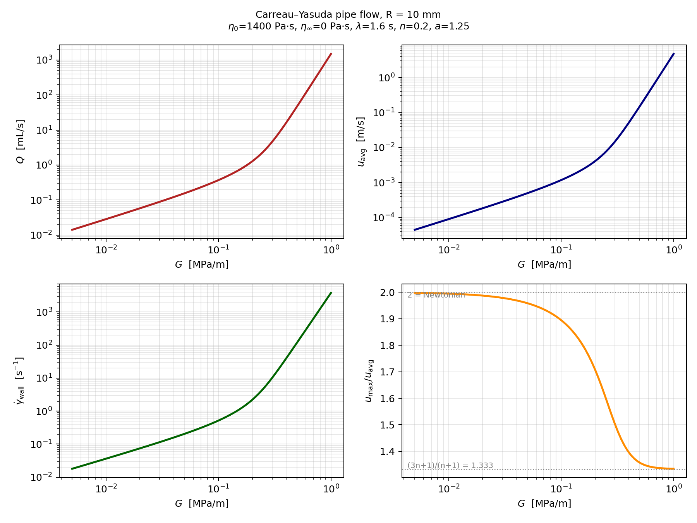
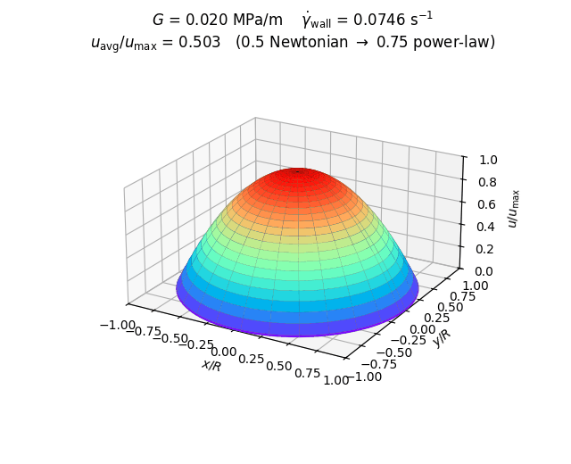
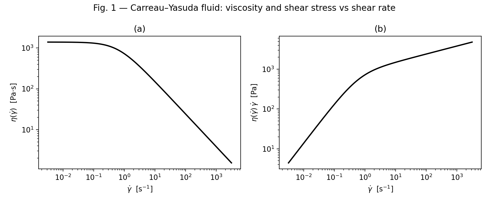
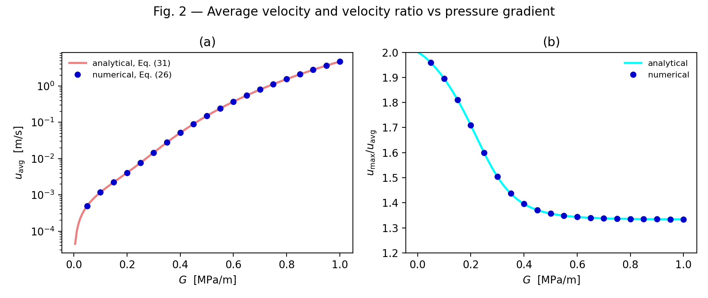
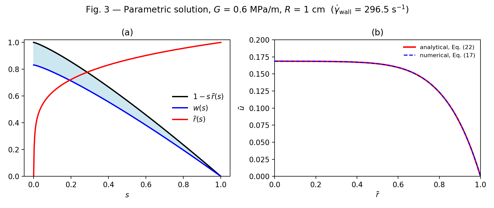

# Carreau–Yasuda pipe flow

Analytical solution of the steady, isothermal, laminar flow of a Carreau–Yasuda
fluid in a straight circular tube (the "Hagen–Poiseuille flow of a Carreau–Yasuda
fluid"), as a Python package, command-line scripts, and a browser calculator.

> Y. Wang, *Steady isothermal flow of a Carreau–Yasuda model fluid in a straight
> circular tube*, J. Non-Newtonian Fluid Mech. **310** (2022) 104937.
> <https://doi.org/10.1016/j.jnnfm.2022.104937>

The velocity distribution (Eq. 22) and the average velocity (Eq. 31) are
closed-form expressions in the Gauss hypergeometric function ₂F₁; the only
numerical step is solving one nonlinear equation for the wall shear rate (Eq. 4).

**Browser calculator (no installation):** <https://ktwyw.github.io/carreau-yasuda-pipe-flow/web/>

<p align="center"></p>

## What is here

| Path | Purpose |
|---|---|
| `cy_pipeflow/` | Library: fluid model and wall shear rate (`model.py`), hypergeometric solution and dimensional API (`solution.py`), quadrature cross-checks (`numerical.py`) |
| `scripts/reproduce_paper_figures.py` | Regenerates Figs. 1–3 of the paper into `figures/` |
| `scripts/flow_rate_curve.py` | Volume flow rate (plus u<sub>avg</sub>, γ̇<sub>wall</sub>, u<sub>max</sub>/u<sub>avg</sub>) vs. pressure gradient for any fluid and range of G |
| `scripts/velocity_profile.py` | Velocity, shear-rate and viscosity profiles at one pressure gradient |
| `scripts/dome_animation.py` | Animated 3-D "dome" of the profile as G sweeps up, for lectures |
| `web/index.html` | Browser calculator, live at [ktwyw.github.io/carreau-yasuda-pipe-flow/web](https://ktwyw.github.io/carreau-yasuda-pipe-flow/web/) |
| `tests/` | `pytest` checks: agreement with independent quadrature, Newtonian and power-law limits, inverse problem |
| `figures/` | Sample output of every script |

## Installation

```bash
git clone https://github.com/ktwyw/carreau-yasuda-pipe-flow.git
cd carreau-yasuda-pipe-flow
pip install -e .            # library + numpy, scipy, matplotlib
pip install -e ".[test,gif]"  # also pytest and pillow (for the GIF script)
pytest                      # optional: 18 checks, well under a second
```

The scripts also run without installing anything beyond `requirements.txt`
(they add the repository root to `sys.path` themselves).

## Command-line use

All scripts take the same fluid and tube options. The defaults are the paper's
example fluid (η₀ = 1400 Pa·s, η∞ = 0, λ = 1.6 s, n = 0.2, a = 1.25) in a tube
of radius R = 0.01 m. Pressure gradients G are in Pa/m (1 MPa/m = 1e6 Pa/m).
Add `--help` to any script for the full list.

```bash
# 1. Every figure of the paper -> figures/fig1.png, fig2.png, fig3.png
python scripts/reproduce_paper_figures.py

# 2. Flow rate vs pressure gradient over a range of G, with a CSV of every quantity
python scripts/flow_rate_curve.py --gmin 5e3 --gmax 1e6 --num 80 --log --csv Q_vs_G.csv

# 3. Velocity profile at G = 0.6 MPa/m (the conditions of Fig. 3), with the Fig. 3(a) construction
python scripts/velocity_profile.py --G 6e5 --terms

# Your own fluid in a 2 mm capillary
python scripts/velocity_profile.py --eta0 50 --eta-inf 0.1 --lam 0.5 --n 0.4 --a 2 --radius 0.002 --G 2e6
python scripts/flow_rate_curve.py   --eta0 50 --eta-inf 0.1 --lam 0.5 --n 0.4 --a 2 --radius 0.002 --gmin 1e4 --gmax 1e7 --log

# Lecture animation: u/(R γ̇_wall) on a fixed scale, or --normalized for u/u_max (shape only)
python scripts/dome_animation.py --normalized
```

<p align="center"><br>
</p>

## Library use

```python
from cy_pipeflow import (CarreauYasuda, solve_pipe_flow, velocity_profile,
                         flow_rate_curve, pressure_gradient_from_flow_rate)

fluid = CarreauYasuda(eta0=1400.0, eta_inf=0.0, lam=1.6, n=0.2, a=1.25)  # Pa·s, Pa·s, s, -, -
R = 0.01                                                                 # m

res = solve_pipe_flow(G=0.6e6, R=R, fluid=fluid)      # G in Pa/m
res.gamma_wall, res.u_max, res.u_avg, res.Q, res.ratio
# -> 296.5 s^-1, 0.500 m/s, 0.372 m/s, 1.169e-4 m^3/s, 1.343

prof  = velocity_profile(0.6e6, R, fluid)             # prof.r [m], prof.u [m/s], prof.gamma, prof.eta, prof.tau
curve = flow_rate_curve([1e4, 1e5, 1e6], R, fluid)    # dict of arrays: Q, u_avg, u_max, gamma_wall, ratio, ...
G = pressure_gradient_from_flow_rate(Q=1e-4, R=R, fluid=fluid)   # inverse problem, e.g. capillary rheometry
```

The dimensionless building blocks of the paper are exported with their equation
numbers in the docstrings: `reduced_parameters` (Table 1, Eq. 6), `eta_tilde` (9),
`r_tilde` (8), `Phi` (19), `w` (18), `u_tilde` (22), `u_max_tilde` (23),
`u_avg_tilde` (31). `cy_pipeflow.numerical` integrates Eqs. (17) and (26)
directly, without `hyp2f1`; the tests require the two routes to agree to 1e-9.

## Browser calculator

**Try it online: <https://ktwyw.github.io/carreau-yasuda-pipe-flow/web/>** — nothing to install.

Enter the five Carreau–Yasuda parameters and the tube radius, then use the three tabs:

- **Viscosity curve** — η(γ̇) and the shear stress η(γ̇)·γ̇ of the fluid (Fig. 1 of the paper).
- **Flow rate vs. pressure gradient** — Q, u<sub>avg</sub>, γ̇<sub>wall</sub> and u<sub>max</sub>/u<sub>avg</sub> over any range of G, with CSV export and the inverse problem (the G that gives a specified Q).
- **Velocity profile** — u(r), the local shear rate and viscosity at one G, an optional rotatable 3-D surface, and the Fig. 3(a)-style construction of Eq. (22).

The same page is in this repository as `web/index.html`; download it and open it in
any browser to run it locally. All calculations run in your browser in
JavaScript. Browsers have no ₂F₁, so the page integrates Eqs. (17) and (26)
with composite Gauss–Legendre quadrature on a grid graded toward the tube axis,
which reproduces the Python results to about nine significant figures. Only the
plotting library, Plotly.js, is loaded from a CDN (cdn.plot.ly, with jsDelivr as
a fallback).

If the page reports that the plotting library could not be loaded, it was opened
somewhere that blocks external scripts (an e-mail or chat preview, a locked-down
network). Open the file directly in a browser, or for fully offline use download
[plotly-2.35.2.min.js](https://cdn.plot.ly/plotly-2.35.2.min.js), save it as
`web/plotly.min.js` next to the page, and reload.

## Reproduced figures

| Fig. 1 | Fig. 2 | Fig. 3 |
|---|---|---|
|  |  |  |

## Citing

This repository is maintained by the author of the paper. If the code is useful
in your work, please cite the paper above; `CITATION.cff`
carries the reference in machine-readable form (GitHub shows a "Cite this
repository" button from it).

## License

MIT License, Copyright (c) 2026 Yanwei Wang. See `LICENSE`.
